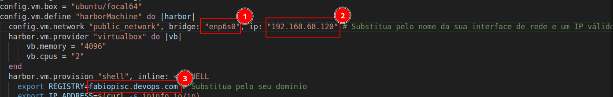

## Vagrantfile para criação do Harbor em ambiente de estudos
Criei este repositório baseado na aula do [P0ssuidao](https://github.com/P0ssuidao) para a turma do PISC 2024 com a finalidade de facilitar a criação de uma máquina de testes do Harbor em ambiente de estudos
### Setup Necessário:

 - Instalação do Vagrant: https://developer.hashicorp.com/vagrant/docs/installation
 - Instalação do VirtualBox: https://www.virtualbox.org/wiki/Downloads
 - Validação da comunicação Vagrant - VBox: https://developer.hashicorp.com/vagrant/docs/providers/virtualbox/configuration

### Como utilizar:
1. Faça um clone deste repositório em sua máquina
2. No arquivo Vagrantfile, altere os 3 campos destacados na imagem:
 
  1 -> Passe o nome da sua interface de conexão com a rede local.
  2 -> Informe um IP livre e válido em sua rede local para a máquina virtual utilizar
  3 -> Escolha um nome de DNS que será utilizado no seu ambiente de estudos do Harbor

### Plus:
Você também pode criar uma entrada no seu arquivo de hosts da máquina local (No Linux, em "/etc/hosts"), para que você possa bater no DNS no navegador e o nome seja resolvido. Por exemplo:

Acessando no navegador:

##
Projeto desenvolvido como parte do treinamento [PISC - Programa Intensivo em Segurança Cloud Native](https://www.linuxtips.io/pisc-programa-intensivo-em-segurana-cloud-native-2)
Qualquer dúvida ou sugestão, entre em contato! [@Fabiobartoli](https://t.me/FabioBartoli)